# Neural Style Transfer Platform

A high-performance, production-ready Neural Style Transfer (NST) web application built using **PyTorch**, **FastAPI**, and a **Vanilla JS Glassmorphism UI**. This platform allows users to merge the content of one image with the artistic style of another using deep learning, specifically leveraging the **VGG19** convolutional neural network. 

This project was built with a focus on real-time feedback, streaming intermediate generation epochs directly to a beautiful frontend UI over SSE (Server-Sent Events), and utilizes the highly efficient **Adam Optimizer** to achieve high-quality style blending in seconds.

---

## Web Dashboard Preview

| Upload Section & Configuration | Live Generation & Results |
| :---: | :---: |
| 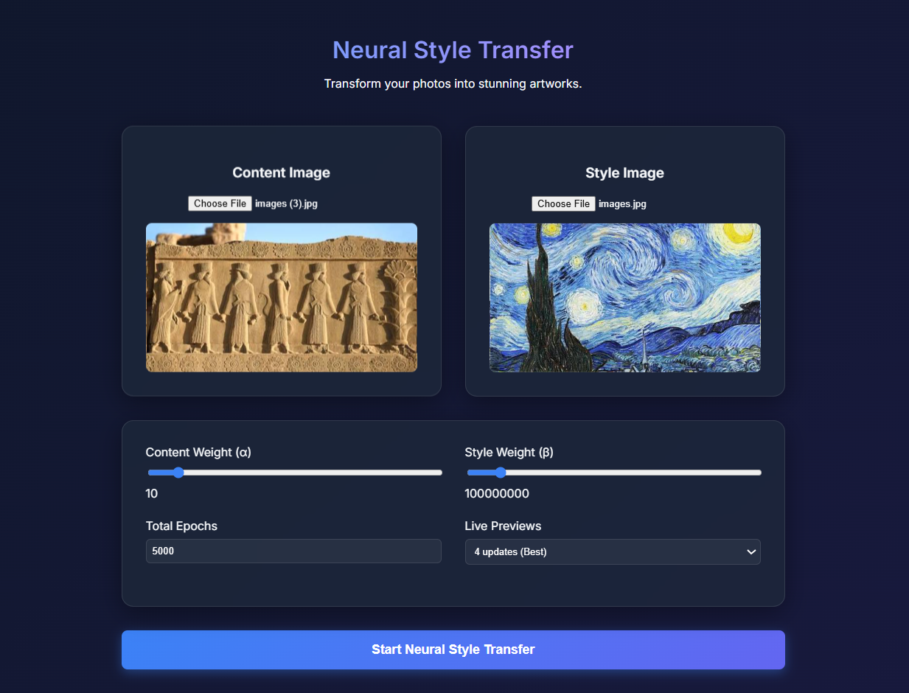 | 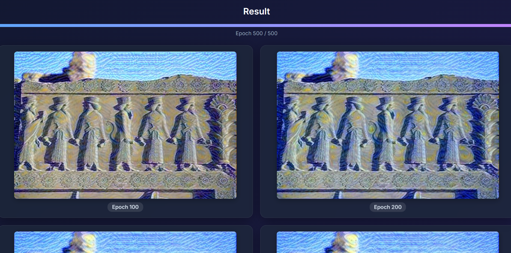 |

---

## The Mathematics of Style Transfer

This platform uses the classical Neural Style Transfer optimization technique proposed by Leon A. Gatys et al. (2015). We optimize a generated image by minimizing three distinct loss functions:

### 1. Content Loss
We extract high-level feature maps from the `conv4_2` layer of VGG19. The content loss is the Mean Squared Error (MSE) between the feature maps of the original content image and the generated image.

$$
\mathcal{L}_{content} = \frac{1}{2} \sum_{i,j} \left( F_{i,j}^{generated} - P_{i,j}^{content} \right)^2
$$

### 2. Style Loss
Style is represented by the correlation between different filter responses across the layers of the network (`conv1_1` through `conv5_1`). This correlation is given by the **Gram Matrix** ($G$). The style loss is the MSE between the Gram matrices of the style image and the generated image across multiple layers.

$$
\mathcal{L}_{style} = \sum_{l=0}^{L} w_l \frac{1}{4N_l^2 M_l^2} \sum_{i,j} \left( G_{i,j}^{generated} - A_{i,j}^{style} \right)^2
$$

### 3. Total Variation (TV) Loss
To ensure the generated image remains visually smooth and less noisy, a Total Variation loss is applied to penalize high-frequency artifacts (pixel-to-pixel variance).

$$
\mathcal{L}_{TV} = \sum_{i,j} \left( (x_{i,j+1} - x_{i,j})^2 + (x_{i+1,j} - x_{i,j})^2 \right)
$$

**Total Objective Function:** Optimized using the **Adam Optimizer**.

$$
\mathcal{L}_{total} = \alpha \mathcal{L}_{content} + \beta \mathcal{L}_{style} + \gamma \mathcal{L}_{TV}
$$

*(Where $\alpha$, $\beta$, and $\gamma$ are weights controlled via the UI).*

---

## Live Epoch Progression & Intermediate Frames

A core feature of this platform is the ability to stream intermediate results to the frontend while the model trains. Instead of waiting blindly for thousands of epochs, the user can request a specific number of "Live Previews".

### How It Works Under The Hood
In `app/ml/pipeline.py`, the backend dynamically calculates exactly when to yield an image back to the frontend based on the user's `num_steps` and `intermediate_frames` inputs:

```python
# Calculate exactly how many steps to wait before sending the next image frame
yield_interval = num_steps if intermediate_frames <= 0 else max(1, num_steps // (intermediate_frames + 1))

for step in range(1, num_steps + 1):
    loss = closure()
    optimizer.step()
    
    # ... (Image optimization logic) ...
    
    # We yield progress exactly at the mathematically calculated interval
    is_image_step = (step % yield_interval == 0) or (step == num_steps)
    if is_image_step:
        yield step, num_steps, tensor_to_image(generated_img)
```
This guarantees mathematically that the user will receive exactly the requested number of frames evenly spaced throughout the generation process, without blocking the GPU thread unnecessarily.

### Epoch Progression Showcase

**Content Image**  


**Style Image**  
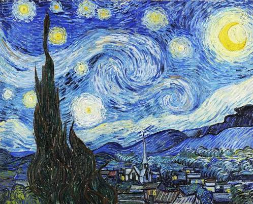

**Generation Timeline:**

**Epoch 100**  
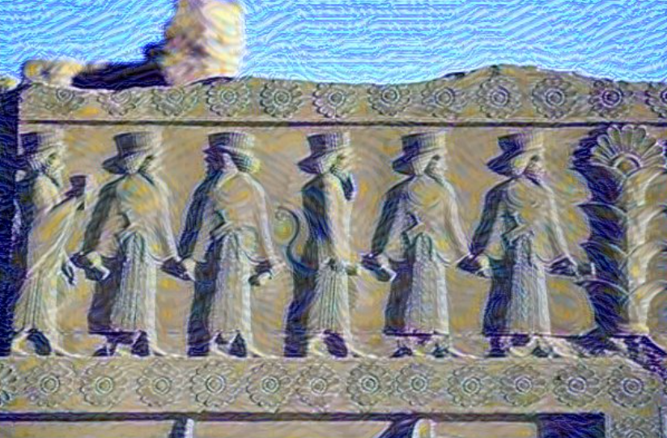

**Epoch 500**  
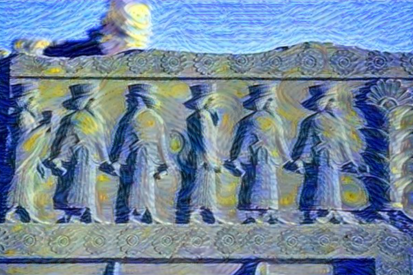

**Epoch 1000**  
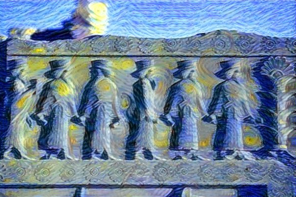

**Epoch 3000**  
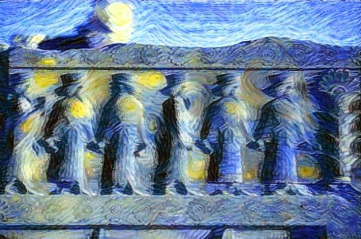

**Epoch 5000**  
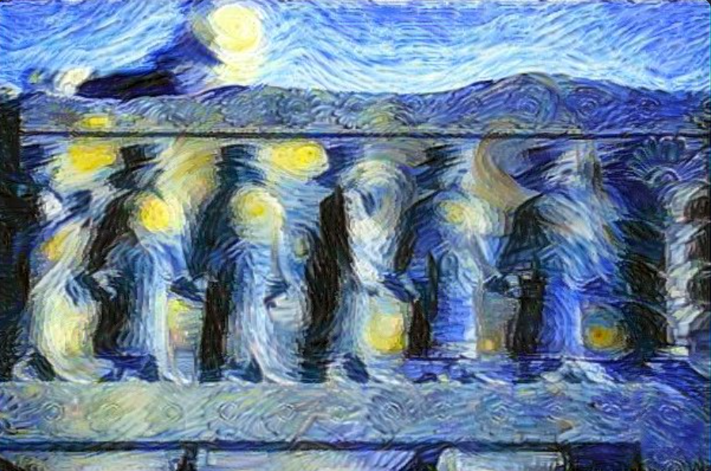

---

## More Examples

| Content Image | Style Image | Generated Result |
| :---: | :---: | :---: |
| 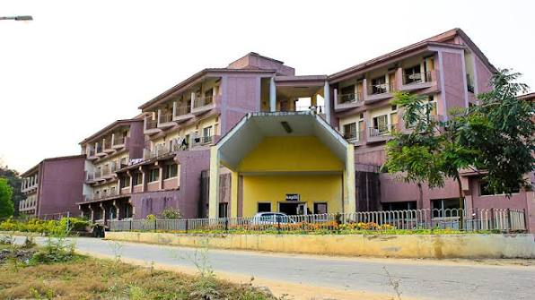 | 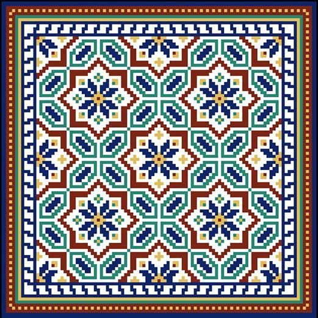 | 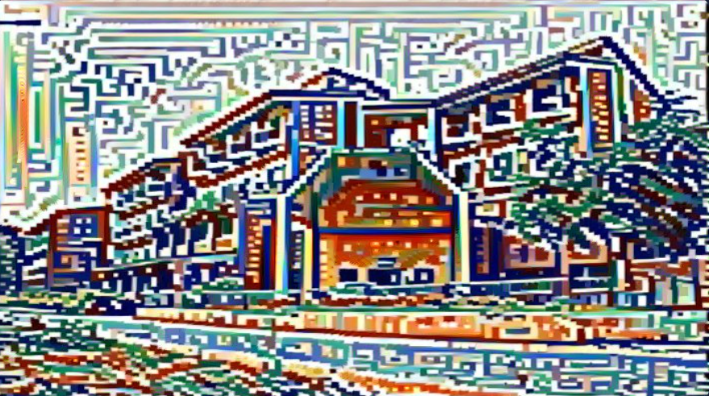 |
| 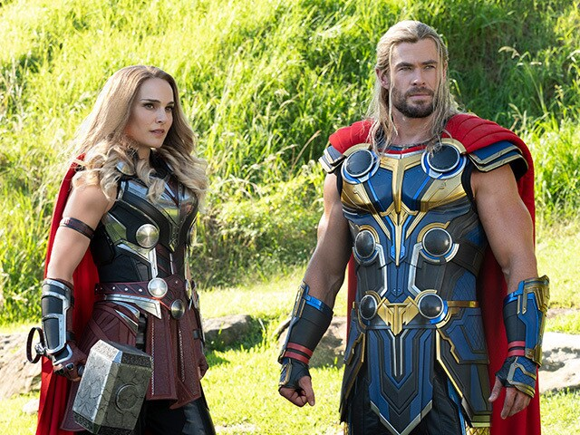 | 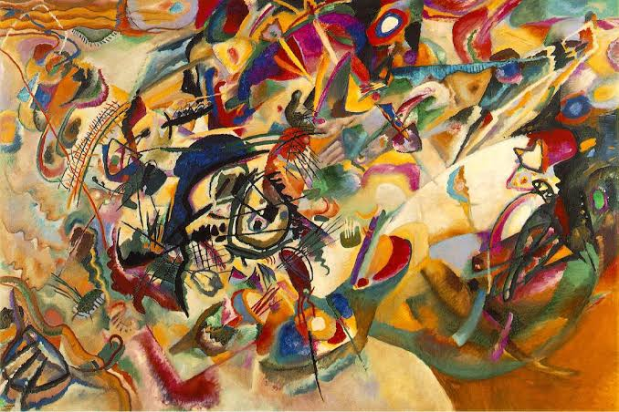 | 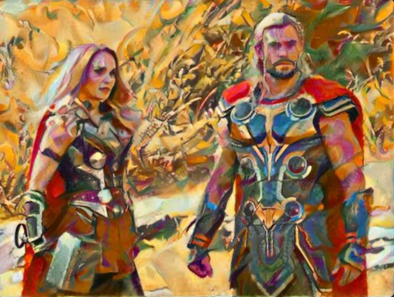 |
| 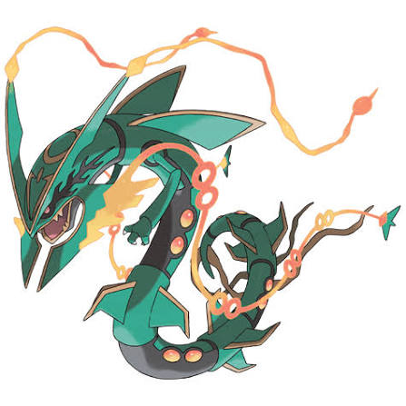 | 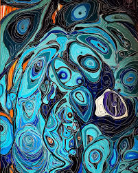 | 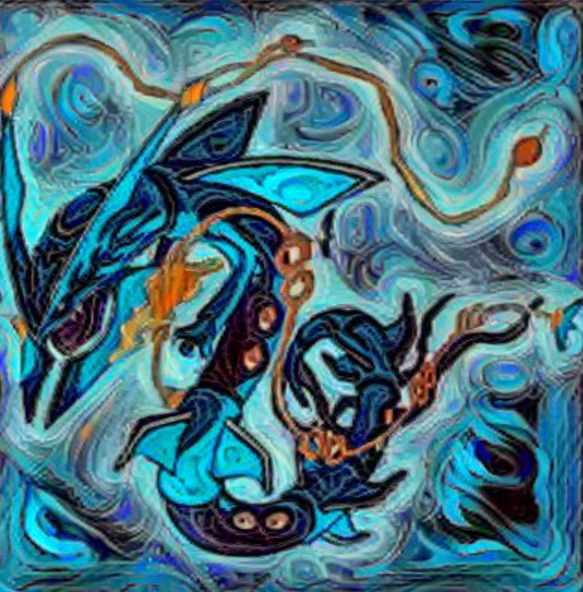 |

---

## Getting Started

This application requires a GPU for reasonable generation times. You can run it on a free Cloud GPU or locally on your own machine.

### Option A: Free Google Colab GPU (Recommended)
You don't need a powerful laptop to run this! You can use a free Google Colab T4 GPU.

1. Go to [Google Colab](https://colab.research.google.com/).
2. Click **File -> Upload notebook**.
3. Upload the `Colab_Deployment.ipynb` file included in this repository.
4. In Colab, click **Runtime -> Change runtime type** and ensure **Hardware Accelerator** is set to **T4 GPU**.
5. Click **Runtime -> Run All**.
6. The notebook will print a `loca.lt` URL. Click it, type the provided password, and the UI will open in your browser, powered by the Colab GPU!

### Option B: Local Setup (If you have a dedicated NVIDIA/AMD GPU)
If you have a gaming laptop or PC with a dedicated GPU and CUDA installed:

1. **Clone the repository:**
   ```bash
   git clone https://github.com/Peedobus01/Neural-Style-Transfer-Platform.git
   cd Neural-Style-Transfer-Platform
   ```
2. **Install dependencies:**
   ```bash
   pip install -r requirements.txt
   ```
3. **Run the server:**
   ```bash
   python -m app.backend.main
   ```
4. **Open the App:**
   Open your browser and navigate to `http://localhost:8000`.

---

## Tech Stack
- **Deep Learning**: PyTorch, Torchvision (VGG19)
- **Backend API**: FastAPI (Python), Server-Sent Events (SSE) for streaming
- **Frontend UI**: HTML5, Vanilla JavaScript, CSS3 Glassmorphism design
- **Deployment**: LocalTunnel / Google Colab integration
